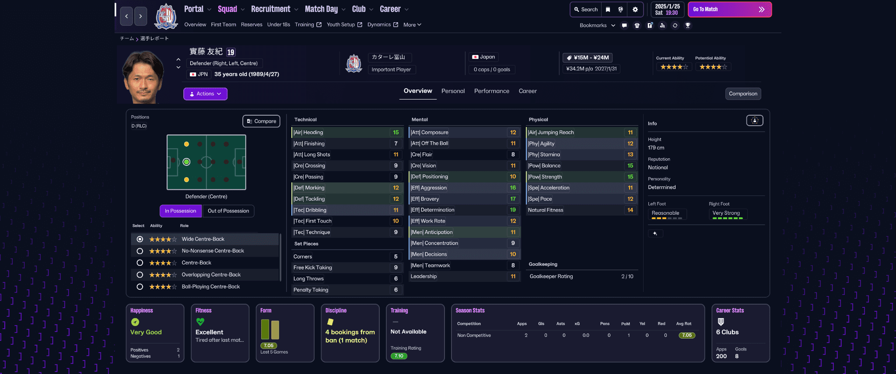

# はじめに

FM26では、前までほどの柔軟性はないものの、SkinのカスタマイズやMod導入ができます。

そこで！！  
今出ているもののうち、個人的に気になるものを色々試してみました。

「導入するか悩んでるけど、微妙にめんどいなぁ・・」という方や「気にはなるけど怖い！実際のところどう変わるの？」という方はぜひ見てってね！！

この記事はけるろんさん主催の[アドベントカレンダー](https://kerlonkerlon.blogspot.com/2025/11/football-manager2026.html)に参加しています。  
立案、管理等ありがとうございます！

# 環境
PCスペックはまあまあの、Windows11です。  
推奨環境以上。

FMのバージョンは26.1.0でした。

# Skin

現時点で公開されているSkinは**6つ**。  
そのうち、最近ベータに配信された26.1.0アップデートに対応しているのは**2つだけ**でした。  
冒頭にも書きましたが、以前までと比べてカスタマイズ性が低くなった + 作成するハードルが上がったので、あまり数が出てないですね・・。  

一応、今後のアップデートでしっかりとしたSkin対応がされる・・らしいよ。  
（今のSkinは半分くらいModのような形で上書きしています）

現時点でのSkinはほぼほぼテーマカラー変更程度しか出来てない模様。  
そのため軽めの紹介とさせていただきます。

## デフォルト

比較用に通常時の画像もどうぞ。

## Material Skin 26

[Material Skin for FM 26 | FM Scout](https://www.fmscout.com/a-material-skin-fm26.html)

確かFM26で一番最初にリリースされたもの。  
FM24でも有名だったSkinですね。

背景イメージが熱いスタジアムになっているのと、全体的な色合いが緑？メインに変わります。

## TinyHips' Dark Mode Skin

[TinyHips' Dark Mode Skin v5.2 [Win + MacOS] *UPDATED 26.1.0* | FM Scout](https://www.fmscout.com/a-tiny-hips-dark-mode-skin-fm26.html)

シンプルな黒が主体になっているSkin。  
初めて使いましたが、すっきり見やすくて良いかもしれません。  
ただ、背景が真っ暗なこともあってか、時々虚無を感じる。

# Mod

Modは**現状8個**公開されています。  

FM24にて公開されていたModは最終的に7個のようなので、実はFM26の方が盛ん。  
（それだけFM26に不満があるということかもしれない・・）

そのうち、気になったものをご紹介。

## FM26 Faster UI Patch

[FM26 UI Speed Patch | FM Scout](https://www.fmscout.com/a-fm26-ui-speed-patch.html)

これだけは使ってる、という人も多いのでは？  
UIの移動スピードがアップすることで、よりゲーム体験を良くするModです。

この動画だけでも何となく伝わると思いますが、本当に操作感が全然違います。  
めちゃくちゃ**体感が良くなる**ので、とてもおすすめ！

通常時
<video controls>
  <source src="/videos/2025-12-10/UISpeedPatch/original.mp4" type="video/mp4" />
</video>

Mod導入時
<video controls>
  <source src="/videos/2025-12-10/UISpeedPatch/patched.mp4" type="video/mp4" />
</video>

## FM26 Camera Mod

[FM26 Camera Mod by Exius | FM Scout](https://www.fmscout.com/a-fm26-camera-mod-by-exius.html)

名前の通り、試合中のカメラ設定を色々と拡張するmod。  
具体的には

- 「ゴール裏」「戦術」「ダイナミック・タッチライン」「縦スクロール」カメラ時の高さやズーム設定の幅を広げる
- フリーカメラ機能を実装（俯瞰カメラと置き換え）

通常時
<video controls>
  <source src="/videos/2025-12-10/CameraMod/original.mp4" type="video/mp4" />
</video>

Mod導入時
<video controls>
  <source src="/videos/2025-12-10/CameraMod/patched.mp4" type="video/mp4" />
</video>

## FM26 Mod: Attributes Grouping

[FM26 Mod: Attributes Grouping | FM Scout](https://www.fmscout.com/a-fm26-mod-attributes-grouping.html)

選手詳細に表示される能力値を、サブカテゴリごとに並び替えるMod。  
他のModと違い、Documentに配置するタイプなので注意。

また「この機能に対応したLanguageを追加する」という形なので、強制的に言語が英語になってしまう。  
日本語ユーザー的にはあまり触手が伸びないかも。

## FM26 Mod: Faster Game Startup

[FM26 Mod: Faster Game Startup | FM Scout](https://www.fmscout.com/a-fm26-mod-faster-game-startup.html)

ゲーム起動時のライセンス表示やらLOADING...やらをすべてスキップしてくれるMod。  
なんやかんやで20秒くらい？待たされるのがなくなるので嬉しい。  
（LOADINGスキップできるなら、あの時間は何を読み込んでるんだ・・？）

僕の環境では26.1.0でも問題なく動作したけど・・。  
「機能しないよ！アップデートしてくれ！」みたいなコメントもあったから、ちょっと気をつけてね。

Mod導入時
<video controls>
  <source src="/videos/2025-12-10/FasterGameStartup/patched.mp4" type="video/mp4" />
</video>

## FM26 Mod: Faster Match Startup

[FM26 Mod: Faster Match Startup | FM Scout](https://www.fmscout.com/a-fm26-mod-skip-to-match.html)

試合が即開始するようになるMod。  

デフォルトでは自動的にスキップされるが、config設定を行うことで手動スキップに切り替えたり、スキップする範囲を調整したりできる。

導入手順がやや特殊で、Football Manager 26フォルダ直下にファイルを配置する仕組みになっている。  
また、起動時にコンソールが表示されるようになり、裏でコンパイルだのなんだのしてたのでちょっと不安な気持ちになる。  
（とはいえMod界隈では割とよくあることではある）  

利用は自己責任でね！

Mod導入時
<video controls>
  <source src="/videos/2025-12-10/FasterMatchStartup/patched.mp4" type="video/mp4" />
</video>

## FM26 Ultimate Realism Mod

[FM26 Ultimate Realism Mod - v1.0 | FM Scout](https://www.fmscout.com/a-fm26-match-realism-mod.html)

マッチエンジンを改変するMod。  
わかりやすく示したりは出来ないので、Modページの説明文を引用。

説明文翻訳

ChatGPTにお任せしました。  
ざっくり見比べたけど、多分合ってる。

**⚽ゲームプレイ仕様**

- 1対1バランス（CLEAN_THROUGH）
  - prob: 10 → 5（-50%）
  - 効果: 明確な決定機（クリアチャンス）が出にくくなり、「ホッケースコア」的な大量得点試合の頻度が低下。
- ボールロスト（LOSE_CONTROL）
  - prob: 10 → 20（+100%）
  - 効果: プレッシャー下でのトラップミス（ボールコントロール失敗）が2倍に増加。
- 天候による混乱（EVENT_PLAYER_OVERHITS_PASS_WIND）
  - prob: 10 → 40（+300%）
  - 効果: 強風がロングボールの精度へ大きく影響するように変更。

**🛡️ディフェンス & ゴールキーパー**

- GKキャッチング（EVENT_GOALIE_CATCH_BALL）
  - prob: 40 → 60（+50%）
  - 効果: キーパーがボールをキャッチする頻度が大幅に増え、安易なこぼれ球が減少。
- 守備の厳格さ（NPT_TENDENCY_TO_MAN_MARK）
  - min_value: <10 → 14（下限値引き上げ）
  - 効果: 全ディフェンダーに「タイトなマーク」が最低限設定され、セットプレーでの受動的な守備を防止。
- インターセプト修正（GOOD_INTERCEPT）
  - prob: 0 → 20（バグ修正）
  - 効果: 以前無効化されていたインターセプトイベントが再有効化。

**🎭“ダークアーツ” & フィジカル**

- シミュレーション／ダイブ（EVENT_PLAYER_DONE_FOR_DIVING）
  - prob: 10 → 30（+200%）
  - 効果: ペナルティエリア内で選手がダイブを試みる頻度が3倍に増加。
- プロフェッショナルファウル（EVENT_SENT_OFF_FOR_PROFESSIONAL_FOUL）
  - prob: 10 → 25（+150%）
  - 効果: カウンター阻止のための「シニカルファウル」がAIの有効な選択肢に。
- 負傷（EVENT_PLAYER_INJURED_FORCED_OFF）
  - prob: 10 → 15（+50%）
  - 効果: 試合のフィジカル負荷が増し、負傷退場がやや増加。
- レフェリーの厳格さ
  - VAR_CHECK prob: 10 → 20（+100%）
  - EVENT_FOUL prob: 10 → 15（+50%）

**🧠戦術AI調整**

- ゲーゲンプレス
  - NPT_TENDENCY_TO_PRESS_INTENSELY（Min）: 15 → 17
  - 効果: 高度なフィジカル能力がないと成立しにくくなる調整。
- ティキタカ
  - WIDTH（幅）: 5–9 → 8–12
  - 効果: パスコース確保のため、チームの横幅を広げる傾向に。
- カテナチオ
  - DEPTH & WIDTH: 1–5に固定（超深いブロック）
- ルートワン
  - DIRECTNESS & TEMPO: 15–20に固定（最大限の直線的プレー）

## FM26 Match Speed Mod

[FM26 Match Speed Mod | FM Scout](https://www.fmscout.com/a-fm26-match-speed-mod.html)

試合中のスピード関連の設定をより細かくできるMod。  
使えたら便利そうだなぁと思った・・のですが。

最終更新日が2025/10/31と古いこともあってか、機能せず。  
残念・・。

# おわりに

アドベントカレンダー参加を決めたときは、もうちょっとSkinだのModだのが活性化していると思ったのですが、意外とそこまで伸びませんでした。  
（その御蔭で検証する数が少なく済んだんですが）

ゲーム自体の作りをより細かくするのも当然大事ですが、Skinで色々なカスタマイズが出来たのもFMの大きな魅力だと思うので、早いところ対応してほしいですね。